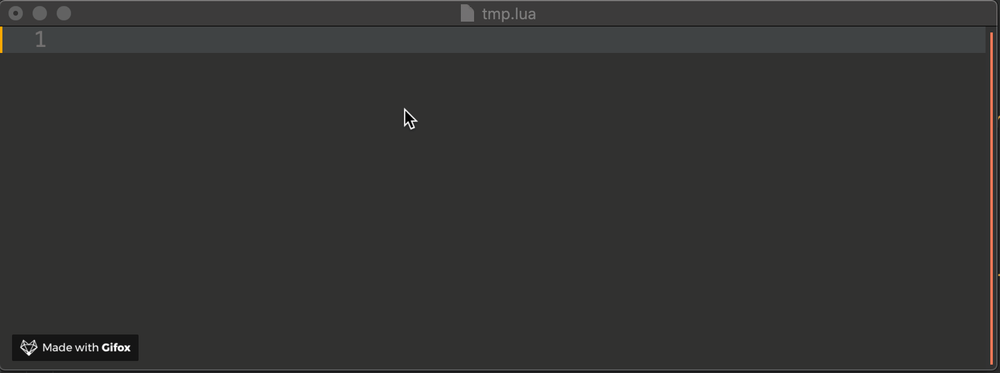
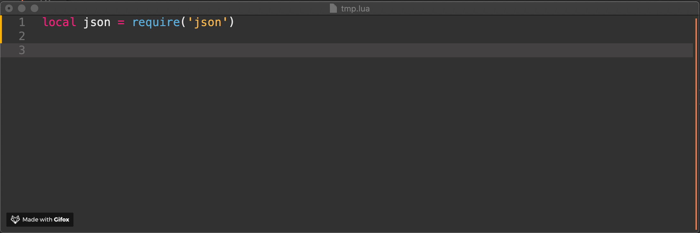

# tarantool-lsp
[](https://travis-ci.org/tarantool/lua-lsp)

A [Language Server][lsp] for Tarantool/Lua code, written in Lua.

[lsp]: https://github.com/Microsoft/language-server-protocol

It is still a work in progress, but quite usable. It currently
supports:

## [lua-lsp legacy][lua-lsp]

[lua-lsp]: https://github.com/tarantool/lua-lsp

* Limited auto-completion
* Goto definition
* As you type linting and syntax checking
* Code formatting
* Lua 5.1

## Tarantool specific
* Autocompletion for Tarantool built-in libs on the fly:

  

* Hovering for Tarantool built-in libs on the fly:

  

* Enhanced completion:
  - [NEW] Completions triggered only on `require`

* Implementation CLI doc manager:

  * parsing Tarantool documentation
  * version management
  * manual updates

* Powered by Tarantool

### Installation/Usage

`tarantool-lsp` can be installed using `brew`:
```
$ brew install https://github.com/tarantool/lua-lsp/raw/master/tarantoollsp.rb --HEAD
```
This will install the `tarantool-lsp`.

To enable Tarantool documentation for the server, say:

```
$ tarantool-lsp docs init
```

To update the documentation, say:

```
$ tarantool-lsp docs update
```

After this, configure your text editor. Language clients can then communicate
with this process using `stdio` as a transport. See [editors.md](editors.md)
for more instructions specific to your editor of choice.

### Library

You can use `tarantool-lsp` as a library for webserver with websocket.

```
tarantoolctl rocks install tarantool-lsp
```

In-code usage:

```
create_websocket_handler()
```

### Plugins

`tarantool-lsp` automatically integrates with common Lua packages when they are
installed. For linting, install `luacheck`:
```
$ luarocks install luacheck
```
For code formatting, we currently support Formatter and LCF. Formatter is 5.1
only, whereas LCF is 5.3 only.

5.1:
```
$ luarocks-5.1 install Formatter
$ luarocks-5.3 install lcf
```
If you have some other package and you would like to see it integrated,
feel free to leave an issue/PR. Other plugins are always welcome, especially
if they provide materially different results.

### Configuration

`tarantool-lsp` reads a few project-level configuration files to do its work.

To configure linting, we read your standard [.luacheckrc][check] file.

For auto-complete support, we reimplement the [.luacompleterc][complete] format
created by `atom-autocomplete-lua`. In particular, we need `luaVersion` to
properly understand your code.

More LSP-specific configuration flags will hopefully be provided through your
editor's configuration support.

[complete]: https://github.com/dapetcu21/atom-autocomplete-lua#configuration
[check]: http://luacheck.readthedocs.io/en/stable/config.html

### TODO

The LSP spec is big, and we don't implement all of it. Here is a
quick wishlist, roughly ordered by priority/feasibility.

* List references (`textDocument/references`)
* Find symbols (`workspace/symbol`)
* Function signature help (`textDocument/signatureHelp`)
* Code links (`textDocument/documentLink`)
* File events (`workspace/didChangeWatchedFiles`)
